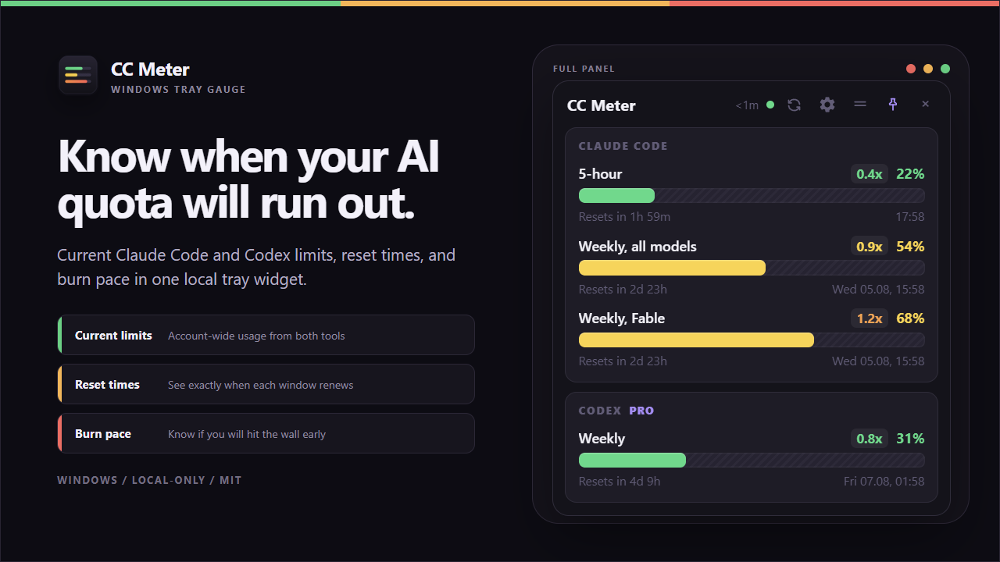
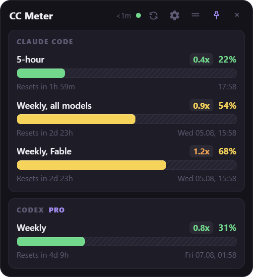
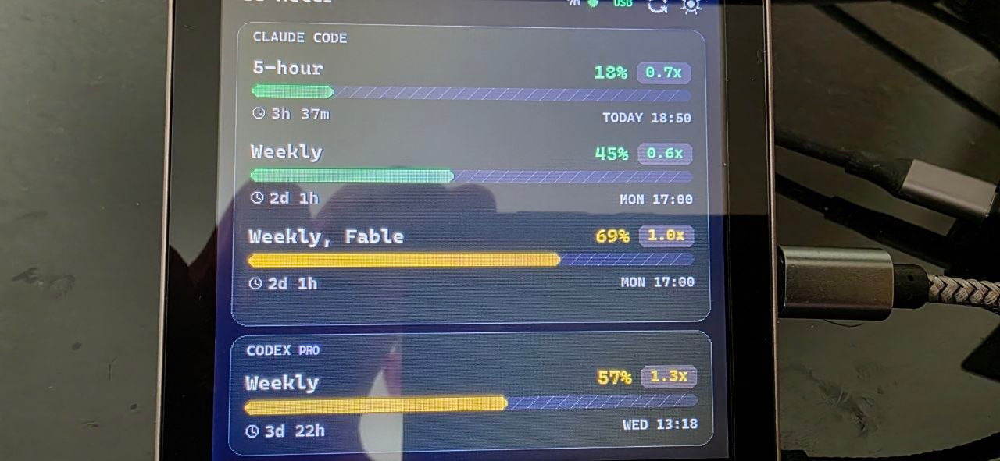
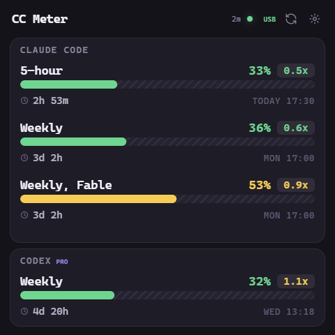

# CC Meter

A tray widget for Windows that shows how much of your **Claude Code** and **Codex**
rate limits you have burned, and how fast you are burning them.



<p align="center"><sub>Representative usage rendered by the full panel at native resolution.</sub></p>

Not a cost tracker. It answers the only question that matters mid-session: *am I
going to hit the wall before this window resets?*

## What it shows

For each limit window: percent used, a bar, the reset time, and a **pace** badge.

Pace is the useful part. `1.0x` means you are burning quota exactly in step with
the clock, so you will run out precisely at the reset. `0.3x` means you are
coasting. `1.6x` means you will hit the wall early, and roughly how early.

- **Claude Code** - 5-hour window, weekly all-models, and weekly per-model
  (Opus, Fable, whichever your plan scopes). The per-model split is real, it
  comes from the same source the `/usage` screen uses.
- **Codex** - the account-wide windows Codex currently reports. One shared
  pool; some plans expose only a weekly window, and CC Meter never invents a
  missing one.

Two modes: a compact strip that docks against the top edge of the screen (with
optional auto-hide until you touch the edge), and a full panel with countdowns.
While dragging the compact strip, it stays snapped to the top edge and fully
inside the active monitor's work area. Hover the tray icon for a short usage
summary, and click it to show or hide the panel without taking focus from your
current window.

<p align="center">
  
</p>

The compact mode stays out of the way at the top edge. [Open the compact strip
at its full native resolution](docs/strip.png).

<a href="docs/strip.png"></a>

## ESP32 hardware display

CC Meter can drive the JCZN/Guition `ESP32-4848S040` 4-inch 480x480 touch
display with a dedicated firmware image. The factory weather, clock, and
lighting interface is replaced completely by the expanded CC Meter dashboard.

<p align="center">
  
</p>

<p align="center"><sub>The physical 480x480 panel running Claude Code and Codex meters over USB.</sub></p>

<p align="center">
  <a href="docs/lcd-preview.png"></a>
</p>

<p align="center"><sub>Exact current 480x480 interface. Click for the native-size render.</sub></p>

The test board cost CHF 21.39 with shipping from AliExpress. Seller prices and
hardware revisions vary, and this project does not sell or bundle the display.

USB is the default connection. The same cable powers the screen, carries live
usage, and handles touch-triggered refreshes. The app detects the board's CH340
serial interface automatically, so no Wi-Fi credentials or router changes are
required. An authenticated local Wi-Fi connection is available as an optional
alternative.

Enable it under **Settings -> Hardware display**. You can then hide the desktop
widget and leave the tray process running as the data source. Firmware source,
build instructions, recovery notes, and the exact board pinout are in
[`firmware/esp32-4848s040`](firmware/esp32-4848s040/).

The normal Windows installer includes the USB data bridge but never flashes a
display. LCD firmware builds as a separate optional
`CCMeter-LCD-Firmware-x.y.z.zip` asset beside the installer in the same release.
Its installation script first saves a complete 16 MB factory-firmware backup,
then writes the CC Meter image. This add-on is only for the 480x480
`ESP32-4848S040` board.

### Hardware quick start

1. Install the matching CC Meter Windows release.
2. Download and extract the matching `CCMeter-LCD-Firmware-x.y.z.zip` asset.
3. Connect the square `ESP32-4848S040` panel directly by USB.
4. Open PowerShell in the extracted folder and run the validation command from
   `SETUP.html` before flashing.
5. After flashing, enable **Settings -> Hardware display -> USB** in CC Meter.

The firmware ZIP includes the full offline setup guide, checksum validation,
automatic CH340 port detection, and a flashing script that refuses to continue
unless it has first saved a complete 16 MB factory backup.

## Install

Download `CCMeter-Setup-x.y.z.exe` from
[Releases](../../releases) and run it. It lives in the tray, not the taskbar.

**The installer is unsigned**, so Windows SmartScreen will show
"Windows protected your PC". Click **More info** -> **Run anyway**. If you would
rather not trust a binary from a stranger on the internet, build it yourself
from the source below. That is the honest answer and it is why the source is
here.

## Updates

The tray menu has **Check for updates...**, and that is the only thing that
ever contacts the releases feed. CC Meter does not check on launch, on focus,
or on a timer, never downloads an update without you choosing to, and never
installs one in the background. If you decline, nothing is staged for the next
restart.

## Where the numbers come from

CC Meter has no hosted service. It makes the Claude usage request to Anthropic
from your machine with your own OAuth token.
For Codex, it asks the installed Codex CLI for the current account snapshot;
Codex handles its own authenticated OpenAI request. CC Meter never reads the
Codex authentication token.

**Claude**: reads the standard Claude Code OAuth token from
`~/.claude/.credentials.json` and calls
`https://api.anthropic.com/api/oauth/usage` directly when the local cache is
older than fifteen minutes. It writes the response to
`~/.claude/usage-cache.json` and honours the cache lock. CC Meter should be the
only automatic caller; status-line scripts should read this shared cache rather
than query the undocumented endpoint themselves.

**Codex**: launches the local Codex app-server and calls
`account/rateLimits/read`, cached for five minutes. This returns the current
account-wide windows even when this machine's session files are old. If an
older Codex version does not expose that method, CC Meter falls back to recent
files under `~/.codex/sessions/` and discards every window whose reset time has
already passed.

### About that token

CC Meter reads your Claude OAuth token off disk and sends it to
`api.anthropic.com` and nowhere else. It is never logged, never stored anywhere
new, and never transmitted to any host but Anthropic's. The direct Claude
network path is isolated in `refreshClaudeUsage()` in `server.mjs`. Codex
authentication and account requests remain inside the installed Codex CLI.

The usage endpoint is undocumented and rate-limited (observed: HTTP 429 with a
~57 minute `Retry-After`). CC Meter refreshes automatically at most once every
15 minutes, suppresses repeated manual taps for five minutes, honours
`Retry-After` exactly, and shares its persisted backoff through
`~/.claude/.usage-api-backoff.json`. Relaunching cannot hammer a locked-out
endpoint. Being undocumented, the endpoint may change or stop working without
notice.

## Local HTTP server

The UI is served from `http://localhost:7373`, and `GET /usage.json` returns the
local usage data. Browser cross-origin access is disabled by default. Enabling
the hardware display's Wi-Fi transport starts a separate token-protected
`/panel/v1/usage` listener on port `7374`; the normal browser UI remains bound
to localhost. No authentication token or session content is returned by either
usage response.

## Build it yourself

```bash
npm install
npm test          # isolated Claude and Codex fixture test
npm start        # dev
npm run dist     # unsigned NSIS installer -> dist/
```

Requires Node 20+ and Windows. macOS and Linux are untested; the tray behaviour
and the screen-edge dock are Windows-shaped.

## Limitations

- Windows only, for now.
- Only works with an OAuth (subscription) Claude Code login. API-key users have
  no plan limits to display.
- Live Codex readings require a Codex CLI version that exposes
  `account/rateLimits/read`. Older versions use the filtered session-log
  fallback and update only when Codex writes a session file.
- Updates are checked only when you ask. The tray menu has
  **Check for updates...**; nothing checks, downloads, or installs on its own,
  and there is no launch-time nag.

## Related projects

CC Meter is not the first physical AI usage display. These projects overlap
with it in useful ways:

- [TokenMonitor](https://tokenmonitor.dev/) is a polished 4-inch, 480x480
  Claude Code, Codex, and Antigravity display with a Wi-Fi broker and a planned
  pre-flashed Kickstarter product.
- [Clawdmeter](https://github.com/HermannBjorgvin/Clawdmeter) is a mature
  Claude Code display with Bluetooth transport, several supported ESP32
  boards, and Windows, macOS, and Linux host support.
- [TokenMeter](https://github.com/alestanalves/TokenMeter) uses a Windows
  bridge and a low-cost 2.8-inch ESP32 touch display for local Claude Code and
  Codex data.
- [codeMeter](https://encinitas3d.com/product/codemeter-a-desk-display-for-your-claude-code-usage/)
  is a pre-built, standalone Wi-Fi product for Claude Code usage.

This project's narrower lane is the low-cost square Guition panel, a single
USB cable for power, live data, and touch refresh, no provider credentials on
the display, and one Windows app that also supplies the desktop and tray meter.

## License

MIT. See [LICENSE](LICENSE).

Not affiliated with, endorsed by, or supported by Anthropic or OpenAI.
